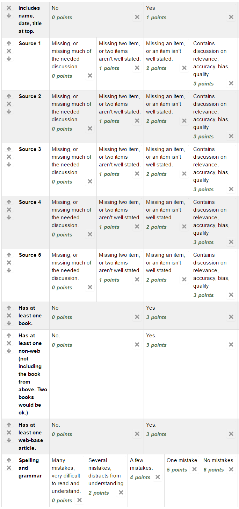

Assignment 3: Annotated Bibliography
====================================

You will be writing a report on 'Big Data' and its impact on *something*.
You get to pick that something. Here are some prior paper titles students have
written:

* Big Data Baseball: Defensive Sabermetrics
* Big Data + Fantasy Football = Success
* How Big Data is Changing Sports
* How Big Data is a Plus to Our Society
* Big Data in Football
* Big Data in Nike Sales
* Big Data and Insurance
* Amazon and Big Data
* Big Data and Personal Data Privacy
* What is Data Mining?
* Big Data Increasing Concert Ticket Prices?
* Big Data in Shopping
* Big Data in Computers
* Big Data and the Economy
* Fitbits and More - Personal Big Data

To get started, find some facts. Do some research and gather ideas. A great way
to do this is to create an `annotated bibliography`_ for your report.

The bibliography must have:

* Five or more sources.

  * One source must be a book.
  * One source must be an article that isn't exclusively for the web.
  * One source must come from the web.

* Use MLA style to create a bibliographical entry.
* Annotate each entry. That is, write about:

  * What the resource says.
  * Talk about the relevance of the article to your paper. That is, how would
    you use it?
  * Talk about the accuracy.
  * Talk about the bias of the article.
  * Talk about the quality of the source.

Thursday will be "library day" to work on this.

* Meet at the library.
* Bring a notebook or notebook computer.
* Pick your topic. Pick a back-up topic. Pick a third topic if the first two fail.
* Spend time "prepping" so that you have the format of the bibliography
  all ready. That is, make sure your file is ready to start entering info, so you
  don't spend the time messing about with formatting rather than doing research.
* See the example annotated bibliography on Scholar.
* Try finding a few starter resources before you even get to class. This will give you more
  time to ask questions in class and get feedback. Otherwise you might be stuck
  with questions when you don't have anyone to answer them.
* Have you done enough prep-work to make sure that you've got questions? Great!
  then you are ready for Thursday's class.
* While at class on Thursday use Maddy, Christopher, Dr. Craven, and the library
  staff to help you in your research.
* Finish the bibliography outside of class, and upload to Scholar.

Grading rubric:

Next assignment will be to create an outline, then we will write the paper.

.. _annotated bibliography: https://owl.english.purdue.edu/owl/resource/614/03/
