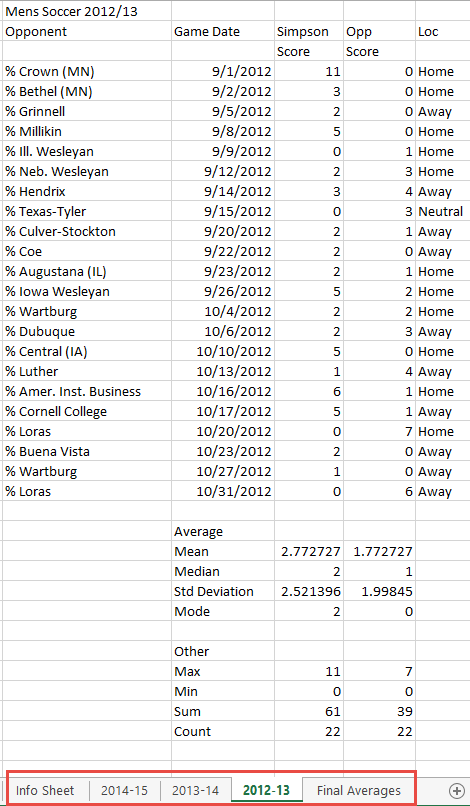
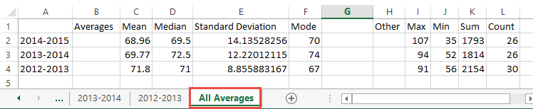

Assignment 2: Basic Excel
-------------------------

Open a new Excel document.

Create a information sheet, with your name, date, and a title. Name this tab
"Information".

Switch/create another tab.

Pick a different sport than what we did in class as a tutorial. Use Excel to
analyze the data. Remove unnecessary data. Set column width to proper values.

Do this for three years. Your result should look something like this:

Finally, create a separate tab to hold the summary data:

Double-check the rubric that is posted for this assignment. Make sure you have
done the assignment in a way to get full points. Then upload the assignment
on Scholar.
