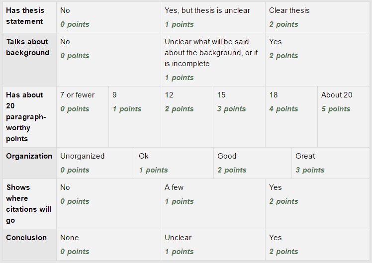

Assignment 4: Outline
=====================

The goal of this assignment is to create an outline of the "Big Data" paper.
First, read the :ref:`outline-tutorial`.

You should include:

* Name, date, title at the top. Even if you submit it electronically, still put
  this up there.
* A draft **introduction**. Include a `thesis statement`_. I should be able to
  easily find the thesis statement, and not get confused about which sentence it is.
  The thesis needs to involve Big Data. That is, anything that involves processing
  thousands or millions of data items.
* Background on the topic. Depending on how much background is needed, this might be part of
  the introduction, or the paper might need additional paragraphs.
* **Major Points**. You will likely need a major point for each paragraph. Each
  paragraph is about 50 words. So you'll need about 1000 / 50 = 20 points. So
  you should have 20 or so paragraph-worthy points. Some points might be worthy
  of multiple paragraphs. If so, you'll probably have a major point, and then
  minor points for each paragraph.
* Do your points have to do with Big Data? Make sure to clearly tie it in. Don't
  assume the reader will do so.
* Put **citations** in with major points the support. This is important! Put a
  proper MLA in-text citation next to the point in your outline where you plan on
  using it. This is the most frequently missed point.
* **Conclusion**. Don't just restate your thesis and your introductory paragraph.
  Figure out how to bring this paper to a strong close.
* Double check to make sure your points support the thesis.

Here's the grading rubric:

.. _thesis statement: https://owl.english.purdue.edu/owl/resource/545/01/
