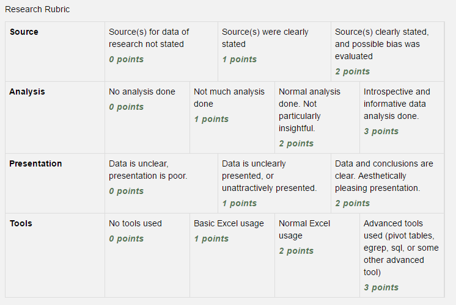

Assignment 12 - Paper 3 - Research
==================================

Paper 3 - Research

Turn in an MS Word document with your research.

* Include name, date, title.
* Provide your data. You'll likely need to copy/paste it into the document. I
  don't want separate Excel documents uploaded. Present you data the way it
  would be in the paper.
* Note that in the rubric there are different levels for how much processing
  you did with your data. Let me know what you did for processing. If you used
  a pivot table, say so. If you used other tools, talk about them.
* Make your data look presentable
* Talk about possible bias in the data.
* Analyze the data. What does it mean? Explain it.
* Once you've got you data, you'll put the analysis of your group together and
  then writing a paper around it.

