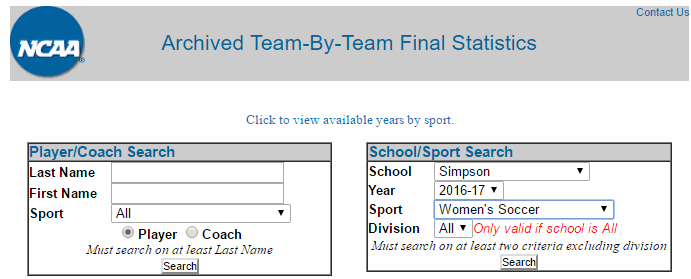
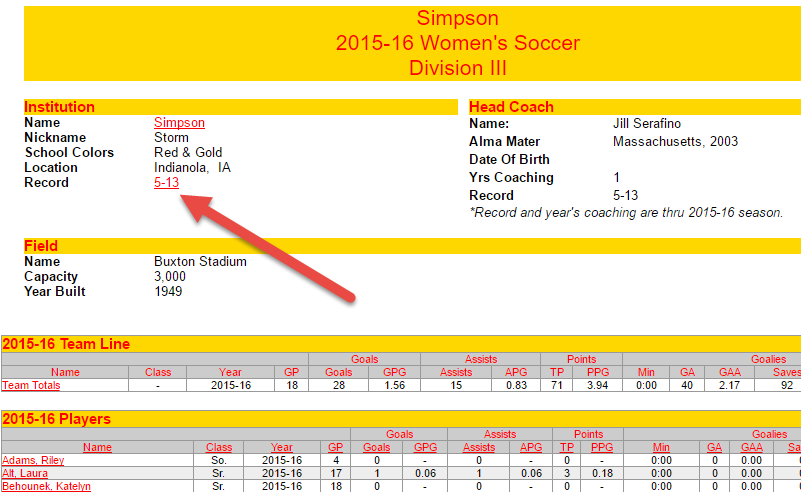
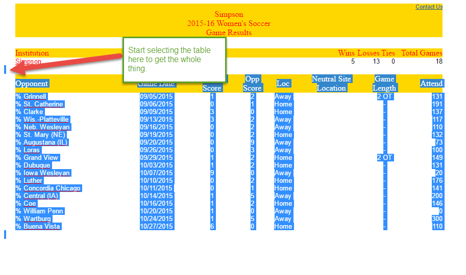
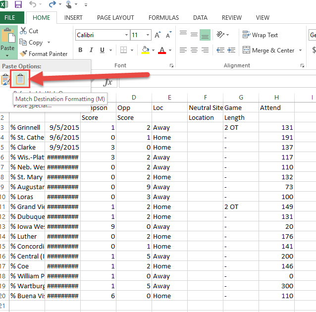
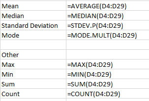

Working with Statistics Functions in Excel
==========================================

Start here:

http://web1.ncaa.org/stats/StatsSrv/careersearch

Select last year’s women's soccer data for Simpson:

Hit 'Search'. Then select 'Simpson'. You should get a lot of data. But it isn't
the data we want right now. Click on the link for the record:

To successfully select the table, you need to start copying the table before it
begins. If you start in the table, it won't copy the table into Excel and it will
be all one one line.

Now that we've copied the data, paste it into Excel. We usually will want to
"match the destination formatting" and not copy the extra style stuff from the web.

* Show how to resize columns
* Show how to search/replace
* Show how to do cell references
* Show how to do equations
* Learn to do common stat functions

* Learn to create a new sheet
* Set a title
* Copy/paste cells
* Copy/paste while transposing

