Pivot Tables
============

When working with large data sets, Pivot Tables are a powerful
tool for data analysis. Let's learn by example how they work.

To get started, download this Excel data file on colleges (NCES, 2016):

`sc_101_college_data.xlsx <../../_static/sc_101_college_data.xlsx>`_

Go ahead and open it up. It has a lot of data. We can't tell too much about the data yet.

To start, we need to create the Pivot Table. Select cell A4, the top left corner
of the data we want. Then hit Ctrl-A to select all.
(Or ctrl-shift right arrow, followed by the down arrow.) It should look like this:

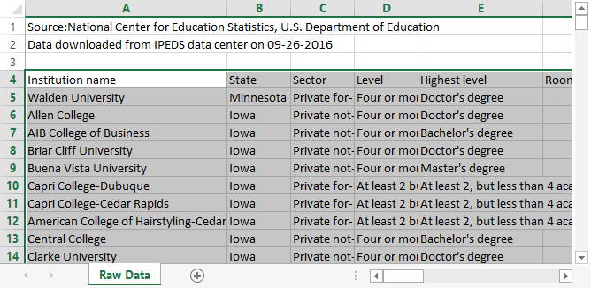

Next, select the "Insert" tab, followed by "Pivot Table"

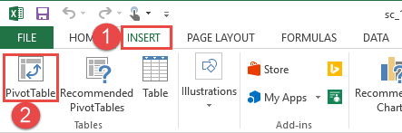

For the next dialog, the defaults should be fine. We already selected the data,
so that fills in for us. And we want to start our work on a new worksheet tab.

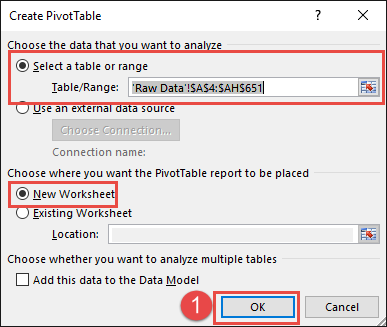

Next, Excel gives you something that seems about as clear as mud. Let's find
the main parts:

1. This is where your results will go. We don't have any yet, so it is blank.
2. These are the columns in your report. We will take these and drag them into
   on of the boxes below.
3. These are where we will drag some of the fields from (2)]

* A. Drag fields here to "filter" the data. If you only want to see colleges
  from Iowa, set up a filter.
* B. This controls what shows in the columns. If you put "state" here, then
     each column will be a different state.
* C. This controls what shows in the rows. If you put "state" here, then
     each row will be a different state.
* D. This shows what values will appear in the table. If we put "Sum of Fall 1990"
  we will see the number of students enrolled in the Fall of 1990.

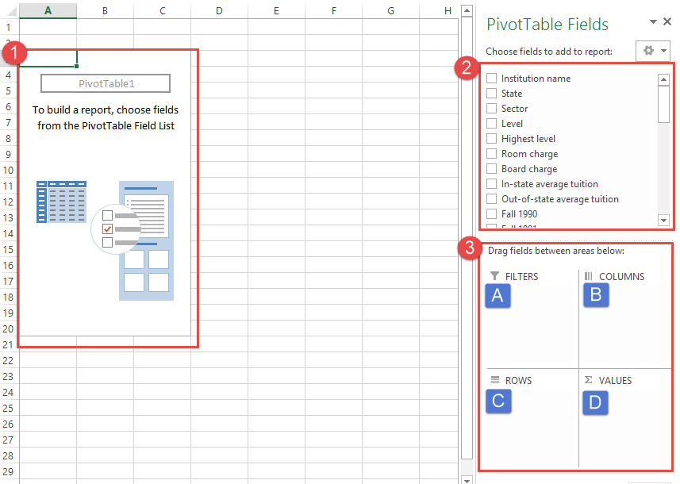

Next, let's take the "State" field and drag it into "rows." When you do this,
you should see each state take a row.

After than, take "Fall 1990" and drag it to values. By default we get "count."
"Count" will count the number of rows. Therefore if we have four rows
with (4, 10, 0, 100) in them, we will get "4". Because there are four rows. It
ignores the values.

From the results we can see that Missouri has the most schools, while North
Dakota has the fewest.

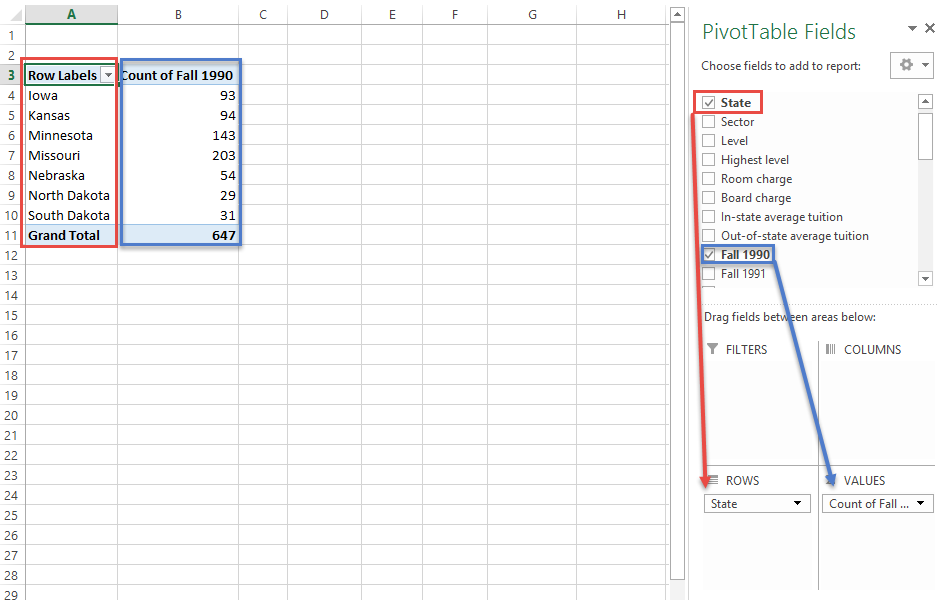

What if we don't want a "count" of schools? Select the count field (step 1 below)
and then select "Value field settings" (step 2 below)

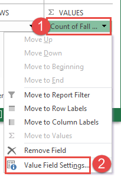

You can change the name of the field (step 1 below) and what we are calculating.
If I select "sum" (step 2) I will get the total number of students in the state.
If I select "Average" I'll get the average number of students. I can also change
the number format. I changed the name, selected "sum," and changed the number
format. See below:

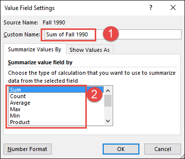

And I'm rather happy with my result.

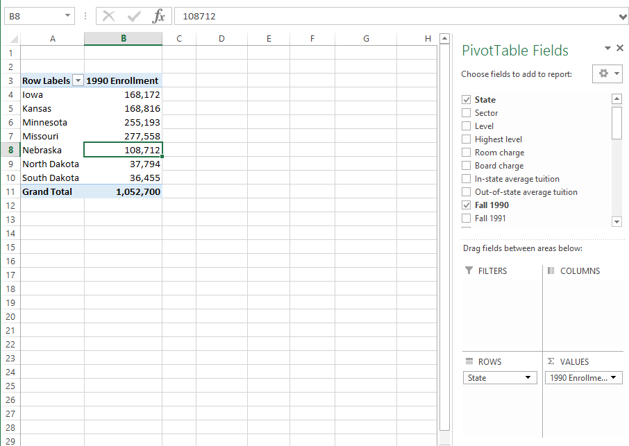

Let's expand this by adding in 2014 enrollment:

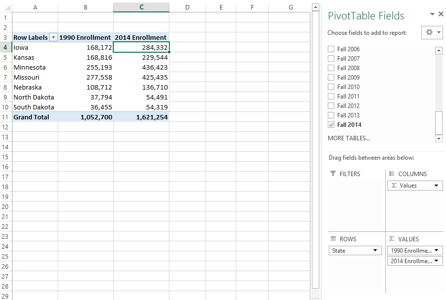

Why stop there? Let's add in 1990, 2000, 2010, and 2014 enrollment.

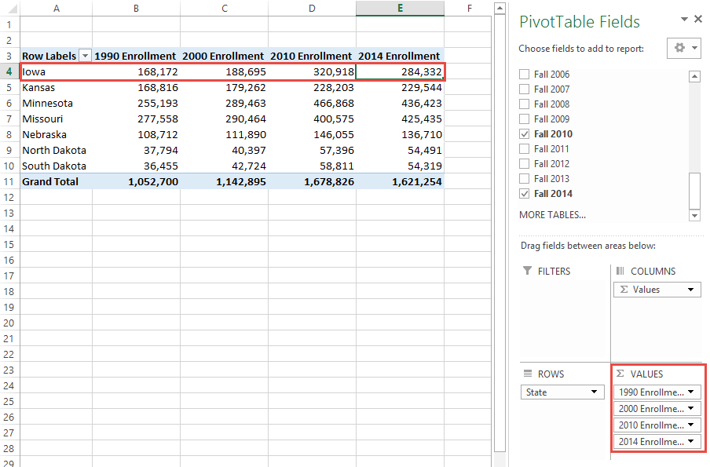

From this I can see that Iowa has taken a real hit in student enrollment
while Missouri has done better.

You can make a more complex table. Here I am using both state, sector, and
Fall 2014 enrollment:

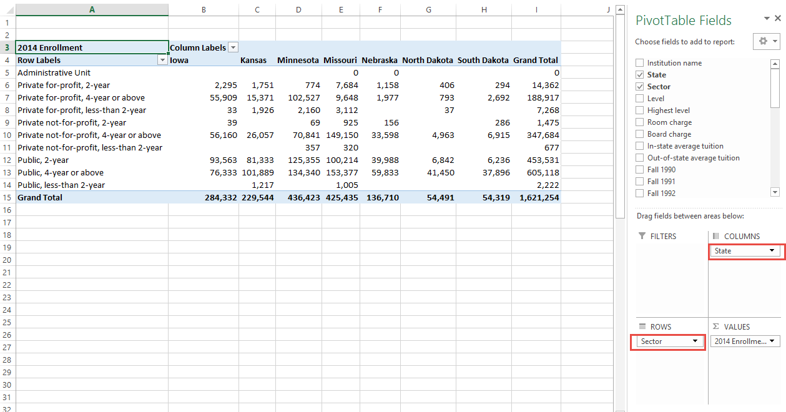

I can spot some interesting information in this table. But the is too complex
to easily spot what I'm looking at. I'll click on the 'down' arrows in the
row and columns to add filters. That was I can narrow in on the interesting data:

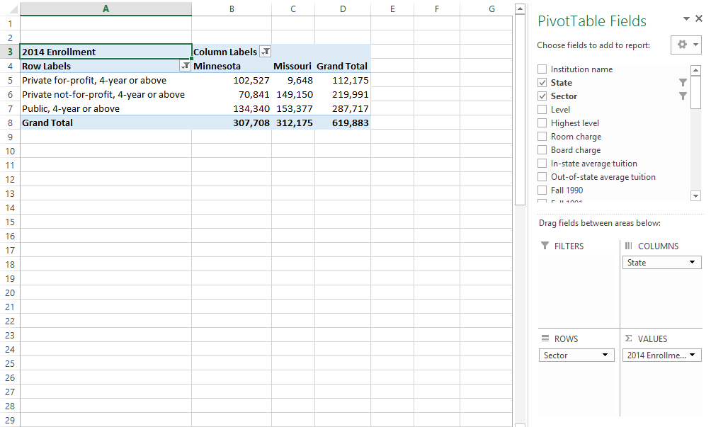

Look, for-profit colleges are clearly more popular in Minnesota! Given that
Minnesota is more liberal than Missouri, I would have thought the opposite.

But an Excel file is not a report. I need to move this data into a report.
I copied and pasted the table into MS Word. I adjusted a few fields to make
the labels clearer. Then I wrote an explanation and citation around my data:

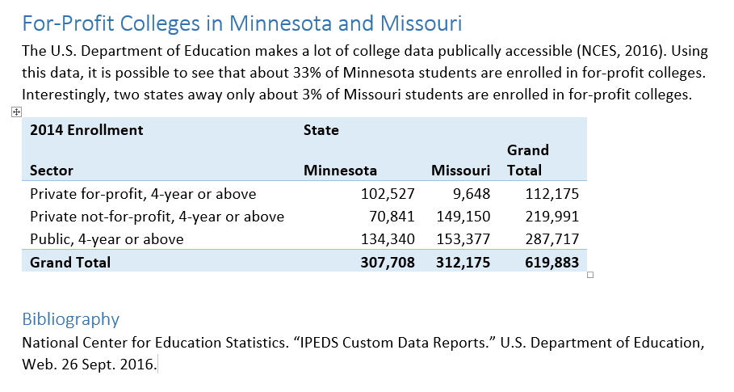

That's it! I've used a Pivot Table to crunch 650 records of data
with 14 fields each, and learn something I didn't know before.

Bibliography
------------

National Center for Education Statistics. "IPEDS Custom Data Reports." U.S. Department of Education, Web. 26 Sept. 2016.

