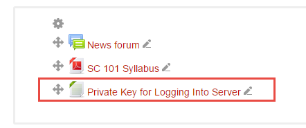
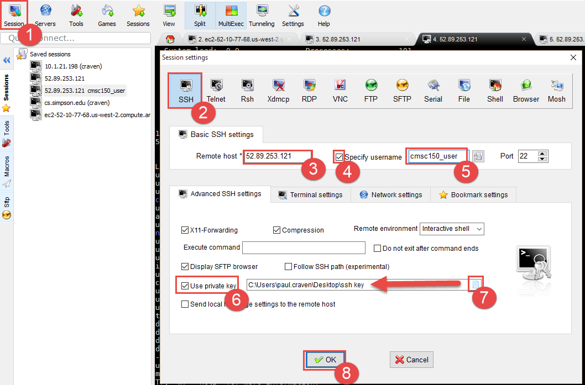
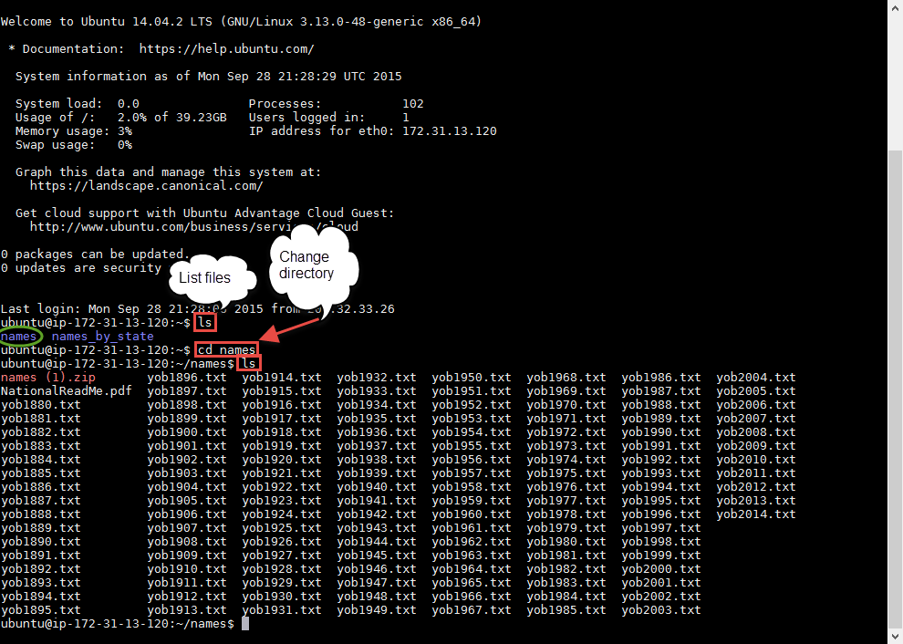
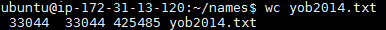
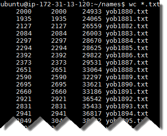
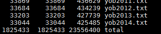
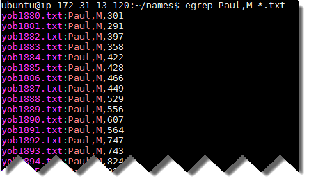

Tutorial: Processing Names
==========================

Read this article: `How to Tell Someone's Age When All You Know Is Her Name`_.

Let's do something similar. Let's find when a person likely was born based on
their age.

Getting the Data
----------------

You can get all the names of everyone born from the Social Security
Administration here:

http://www.ssa.gov/oact/babynames/limits.html

We get the name, the count of people with that name, the sex, and the year born.
But wait! Don't download the data yet.
The data involves too many rows to easily process in Excel.
Let's learn some new tools.

* Linux Computer - We will be using a computer running the Linux operating
  system that I've set up using Amazon's cloud computing tools. This computer
  already has the data on it.
* MobaXTerm - We need to get to that remote computer somehow. We will use a
  terminal program. A terminal program is like a web browser, but more primitive.
  It can receive characters and display characters. There are many terminal
  programs just like there are many web browsers. The terminal program we will
  use is called MobaXTerm_. Macs are similar to Linux in many ways and already
  have a built-in program called "Terminal."
* Command-line tools - Into this terminal we will be typing commands that go
  to the computer that exists at Amazon. Rather than clicking on tools, we will
  be typing them in.

Wait, what is the source of my data? The source of this data is *not*
MobaXTerm any more than Chrome is what you'd list for a source on a report.
The data comes from the Social Security Administration. That is your source.

Command Line
------------

Again, we will be using something called the "command line." Rather than using the
mouse and menus, we will go old-school and type in commands. We can process
more data this way.

Also, rather than use "Microsoft Windows" or "MacOS" we will be using a different
operating system called "Linux_."

Another thing that we *could* do with the command line is to create a file
with all the commands we need. Then we could run that file, for each name. We
don't have to recreate our work.

This isn't something you can do with a graphical interface.

To use the command like interface, we need to learn some commands.

Here is a reference of commands we will need:

======================================== =====================================
Command                                  Description
======================================== =====================================
``ls``                                   List files in the current directory.
``ls -la``                               List file details in the current directory.
``cd <dirname>``                         Change directory
``cd ..``                                Go up one directory
``cat <filename>``                       List the entire contents of a file
``head <filename>``                      List the first few lines of a file
``tail <filename>``                      List the last few lines of a file
``pwd``	                                 Show the current folders (the 'path')
``wc <filename>``	                     Count the words in a file
``egrep '<regex>' <filename>``           Pull out matching lines based on a regular expression
``egrep –c '<regex>' <filename>``        Count matching lines based on a regular expression
``sed 's/<reg>/replacement' <filename>`` Search and replace on a file
``<command> | <command>``                Pipe output from one command into another command
``<command> > file.txt``                 Direct the output to a file
======================================== =====================================

First, from the Scholar class website, find and download the "ssh key" file that
that will let us log into out remote Linux server.

Save it somewhere on a flash drive or on your desktop.
It will act as a really long password to the machine.
Start up MobaXTerm. It is on the lab computers. You can also download it to
your computer if you want. Create a new session. Fill out the session to look
something like this:

**Except:** use 52.27.55.158 as the "Remote host".

Go ahead and connect to the server.

Now we will do the following:

1. List all the files that are in the current folder using the ``ls`` command.
2. Change the folder we are in to the names folder using the ``cd`` command
   followed by the folder name.
3. Again, list all the files our new folder.

After doing this, your screen should look like what is below:

Each of these files contains all the names of births in the United States
for that year, along with the count. It does NOT include a name if fewer
than five people were born with that name.

We can see the contents of the file by using one of these commands:

* ``cat <filename>``	List the entire contents of a file. Bad idea because these are really big files. Hit Ctrl-C to stop the list if you do this anyway.
* ``head <filename>``	List the first few lines of a file
* ``tail <filename>``	List the last few lines of a file

That is a lot of data. How much data? Too much to easily count. Thankfully,
there is a command that will count it for us.

* ``wc <filename>``	Count the words in a file

Try it out:

In my example, computer tells you there are 33,044 lines in the file. 33,044 words in the
file. And 425,485 characters. You might get different results as you are working
on updated data.

Many commands can work on multiple files. You can do this with a "wildcard."
By typing wc *.txt it will run word-count on every single text file in this
directory:

It also gives you a total at the end:

That's 1,825,433 lines we just counted.
 
We can use the ``egrep`` command to use a regular expression and pull out only
the lines we
are interested in. At this point, we won't even use a regular expression, we
will just match text. Here I'm looking for every male named "Paul" born:

Try this with your name, or some other name you are interested in.

Copying the data

* Select the text in MobaXTerm by click-dragging
* It is automatically copied.
* Switch to Excel and paste

Now we need to get this data into a format we can use.

* Search and replace: Replace 'yob' with nothing.
* Search and replace: Replace '.txt:' with a comma.
* Select all the data.
* Click "Data" tab
* Click "Text to Columns"
* Our data is delimited (separated) by commas. So hit 'Next'
* Click 'Comma'
* Click 'Finish'
* Split using text-to-columns and search-and-replace

Figure out how many people are still alive today
Use this data to calculate what percent of people born in a certain year are
still alive. This data came from the Social Security Administration's (SSA's)
`life tables <https://www.ssa.gov/oact/STATS/table4c6.html>`_.
It isn't all that
accurate because the death rate is only for a person born in 2013, but it will
work for our purposes here.
If you plan on being an actuary, you'll likely use these tables a lot.

::

	Age	Male Percent Alive	Female Percent Alive
	0	1.00000	1.00000
	1	0.99348	0.99462
	2	0.99302	0.99425
	3	0.99273	0.99403
	4	0.99252	0.99387
	5	0.99235	0.99373
	6	0.99219	0.99361
	7	0.99205	0.99351
	8	0.99192	0.99341
	9	0.99180	0.99331
	10	0.99170	0.99322
	11	0.99161	0.99312
	12	0.99151	0.99303
	13	0.99138	0.99291
	14	0.99119	0.99278
	15	0.99091	0.99262
	16	0.99052	0.99243
	17	0.99003	0.99220
	18	0.98943	0.99194
	19	0.98870	0.99165
	20	0.98785	0.99132
	21	0.98685	0.99095
	22	0.98572	0.99054
	23	0.98449	0.99010
	24	0.98321	0.98963
	25	0.98191	0.98915
	26	0.98060	0.98864
	27	0.97928	0.98811
	28	0.97795	0.98755
	29	0.97659	0.98697
	30	0.97519	0.98635
	31	0.97376	0.98569
	32	0.97230	0.98500
	33	0.97080	0.98426
	34	0.96927	0.98348
	35	0.96772	0.98265
	36	0.96612	0.98176
	37	0.96448	0.98081
	38	0.96277	0.97979
	39	0.96097	0.97870
	40	0.95908	0.97753
	41	0.95708	0.97627
	42	0.95493	0.97491
	43	0.95262	0.97343
	44	0.95012	0.97182
	45	0.94739	0.97004
	46	0.94441	0.96810
	47	0.94115	0.96597
	48	0.93759	0.96364
	49	0.93368	0.96109
	50	0.92940	0.95829
	51	0.92472	0.95524
	52	0.91961	0.95193
	53	0.91406	0.94834
	54	0.90804	0.94449
	55	0.90153	0.94038
	56	0.89450	0.93598
	57	0.88693	0.93126
	58	0.87883	0.92623
	59	0.87022	0.92090
	60	0.86112	0.91526
	61	0.85147	0.90927
	62	0.84125	0.90287
	63	0.83042	0.89600
	64	0.81899	0.88858
	65	0.80691	0.88054
	66	0.79412	0.87177
	67	0.78054	0.86223
	68	0.76613	0.85187
	69	0.75084	0.84069
	70	0.73461	0.82864
	71	0.71732	0.81561
	72	0.69889	0.80147
	73	0.67930	0.78616
	74	0.65853	0.76961
	75	0.63657	0.75177
	76	0.61329	0.73244
	77	0.58859	0.71148
	78	0.56249	0.68888
	79	0.53504	0.66467
	80	0.50629	0.63880
	81	0.47621	0.61114
	82	0.44484	0.58159
	83	0.41233	0.55016
	84	0.37890	0.51694
	85	0.34482	0.48205
	86	0.31040	0.44565
	87	0.27598	0.40796
	88	0.24201	0.36933
	89	0.20896	0.33017
	90	0.17735	0.29104
	91	0.14768	0.25257
	92	0.12043	0.21542
	93	0.09599	0.18027
	94	0.07463	0.14775
	95	0.05647	0.11839
	96	0.04157	0.09267
	97	0.02977	0.07083
	98	0.02075	0.05285
	99	0.01410	0.03852
	100	0.00935	0.02745
	101	0.00605	0.01909
	102	0.00380	0.01292
	103	0.00232	0.00850
	104	0.00137	0.00541
	105	0.00078	0.00333
	106	0.00043	0.00197
	107	0.00023	0.00112
	108	0.00011	0.00061
	109	0.00005	0.00031
	110	0.00002	0.00015
	111	0.00001	0.00007
	112	0.00000	0.00003
	113	0.00000	0.00001

Create a graph similar to the following for your name of choice:

.. image:: final_result.png
    :width: 640px
    :align: center
    :alt: alt

We could actually process the data and create the graph completely with the command line. That's a bit more involved than this tutorial will get into. But know this: it is possible to automatically create one of these graphs for every single name.

.. _How to Tell Someone's Age When All You Know Is Her Name: http://fivethirtyeight.com/features/how-to-tell-someones-age-when-all-you-know-is-her-name/
.. _Linux: https://en.wikipedia.org/wiki/Linux
.. _MobaXTerm: http://mobaxterm.mobatek.net/